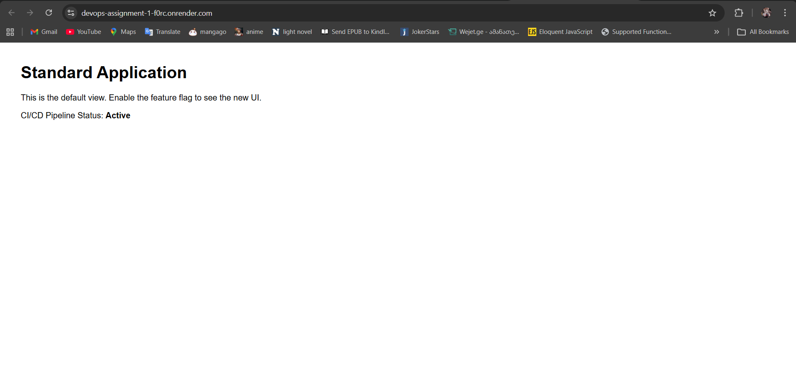
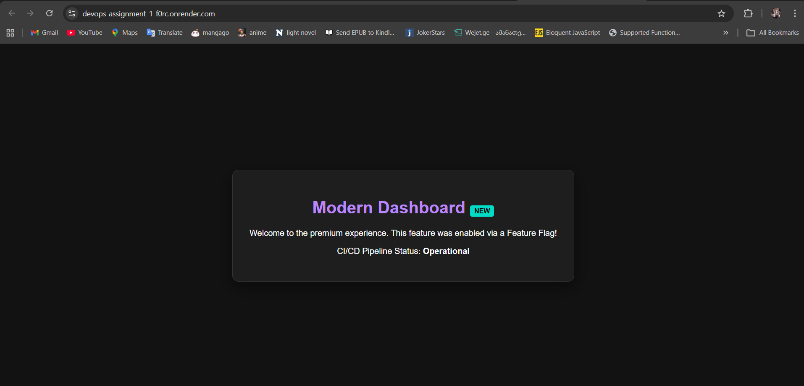
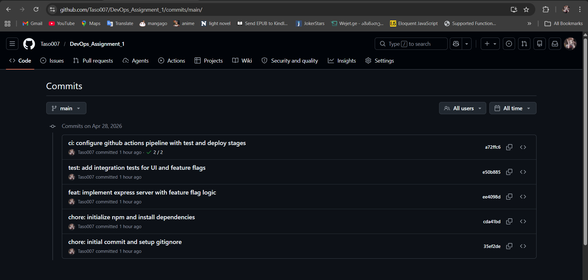

# DevOps Assignment 1: CI/CD Pipeline Automation & Deployment Strategies

## Live Application Link
[https://devops-assignment-1-f0rc.onrender.com](https://devops-assignment-1-f0rc.onrender.com)

## Project Overview
This project demonstrates a robust CI/CD pipeline using **GitHub Actions** for automation and **Render** for hosting. The application is a Node.js Express server that utilizes a **Feature Flag** strategy for controlled releases.

## Pipeline Description
The CI/CD flow is structured as follows:
1.  **Continuous Integration (CI)**: 
    *   Triggered on every `push` or `pull_request` to the `main` branch.
    *   **Environment**: Ubuntu-latest.
    *   **Steps**: Checkout code -> Setup Node.js -> Install Dependencies (`npm install`) -> Run Tests (`npm test`).
    *   **Quality Gate**: If `npm test` fails, the pipeline terminates, preventing any deployment.
2.  **Continuous Deployment (CD)**:
    *   Triggered only after the `test` job completes successfully and only on the `main` branch.
    *   **Action**: Sends a POST request to the Render Deploy Hook.
    *   **Platform**: Render receives the signal, pulls the latest code, and builds/deploys the application.

## Deployment Strategy: Feature Flag
I chose the **Feature Flag** strategy to manage release risks.

### Implementation:
*   **Logic**: The application checks for an environment variable `NEW_UI_ENABLED`.
*   **Default State**: By default, the flag is `false`, and users see the "Standard Application" UI.
*   **Controlled Release**: To release the "Modern Dashboard", I simply update the environment variable in the Render dashboard to `true`.
*   **Benefits**: 
    *   **Decoupled Release**: Code can be deployed to production without being "active" for users.
    *   **Instant Activation**: No new build/deployment is needed to toggle features.
    *   **Safety**: If a bug is found in the new feature, it can be disabled instantly without a rollback of the entire code.

## Rollback Protocol (Render)
If a critical bug is discovered in production, the following steps are performed:

1.  **Instant Fix (Feature Flag)**: If the bug is within the new feature, set `NEW_UI_ENABLED` to `false` in Render's "Environment" settings and Save.
2.  **Full Rollback**:
    *   Go to the Render Dashboard for the specific Web Service.
    *   Select the "Events" or "Deployments" tab.
    *   Find the last stable deployment (the one before the failure).
    *   Click the "..." menu and select **"Rollback to this deployment"**.
    *   Render will instantly point the live traffic back to the previous successful build.

## Screenshots

### Hosted Application (Default UI)

### Hosted Application (New UI Enabled)

### Successful GitHub Actions Run

